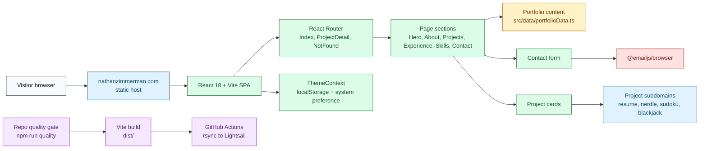
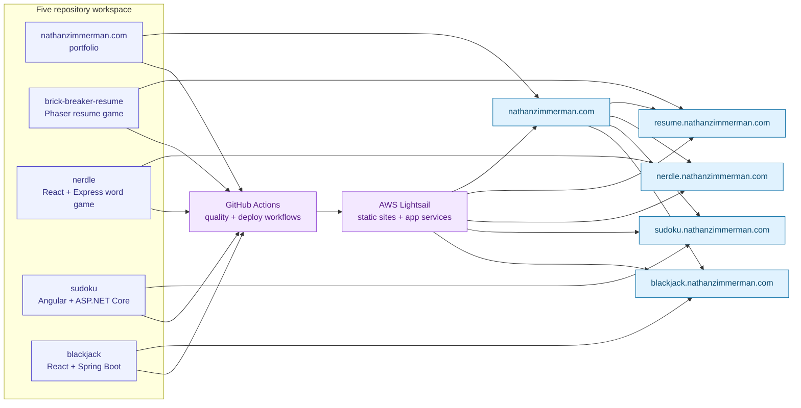

# Architecture

## Runtime Topology

The portfolio is a React 18, TypeScript, and Vite single-page application. Vite builds static assets into `dist/`, while runtime behavior is fully client-side except for third-party EmailJS contact submission.

## Architecture Diagram

## Source Boundaries

`src/pages/` owns route-level composition. `src/components/` owns visible sections and shared UI primitives. `src/contexts/` owns app-level theme state. `src/data/` holds portfolio/navigation content, and `src/lib/` holds reusable helpers and analytics utilities.

## Quality Gates

Run `npm run quality` from the repo root. The gate checks Prettier formatting, ESLint, TypeScript compilation, Vitest coverage thresholds, and the production Vite build.

## Deployment Flow

GitHub Actions runs the root quality gate for pull requests and pushes to `main`. Pushes to `main` upload the built `dist/` artifact, download it in the deploy job, sync it to Lightsail, and verify the production site responds.

## Workspace Connectivity

## Deferred Architecture Follow-Ups

Keep TypeScript strictness hardening separate from this consistency pass. Future work can tighten `tsconfig` flags incrementally and remove unused UI dependencies only after confirming they are not planned design-system surface area.
